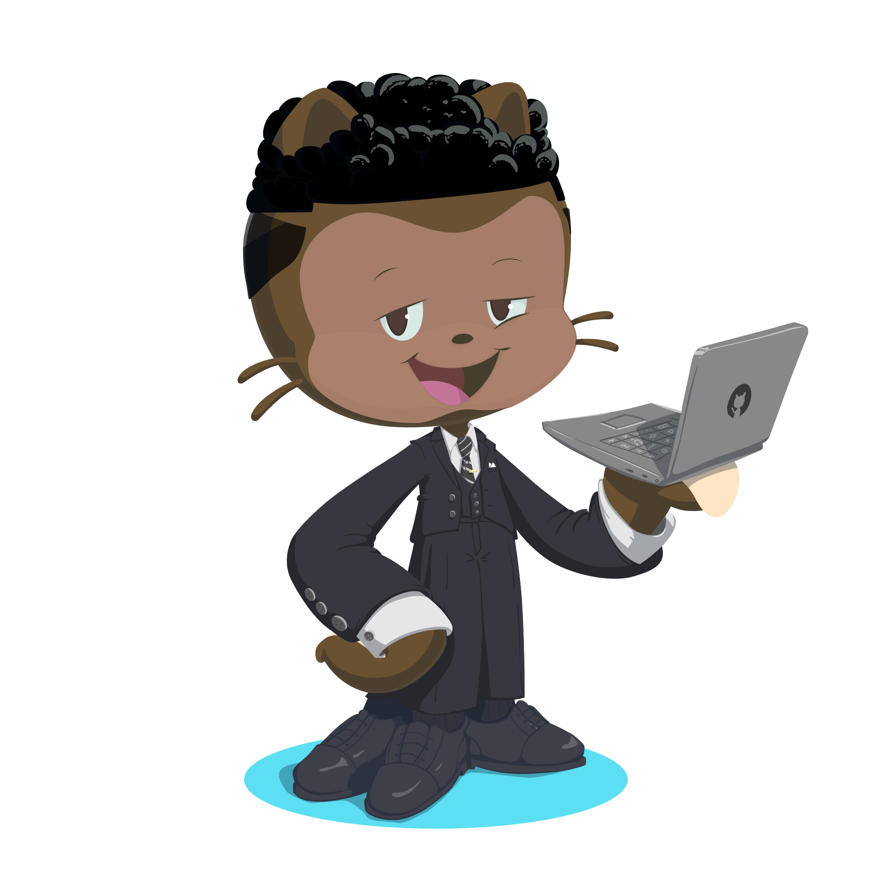

<header justify-content="center"> 
  
</header>

  

  
I'm a Front-End Developer 🧑‍💻 From Rio De Janeiro 🏖️

  

  

  

 
  
  
  
  
  
  
  
  

 

   
  

  <h3><b><samp>Check out my Repositories</samp></b></h3>
  
  
  
 
 

<!--
**AllRez44/AllRez44** is a ✨ _special_ ✨ repository because its `README.md` (this file) appears on your GitHub profile.

Here are some ideas to get you started:

- 🔭 I’m currently working on side projects with @
- 🌱 I’m currently learning ...
- 👯 I’m looking to collaborate on ...
- 🤔 I’m looking for help with ...
- 💬 Ask me about ...
- 📫 How to reach me: ...
- 😄 Pronouns: ...
- ⚡ Fun fact: ...
-->
